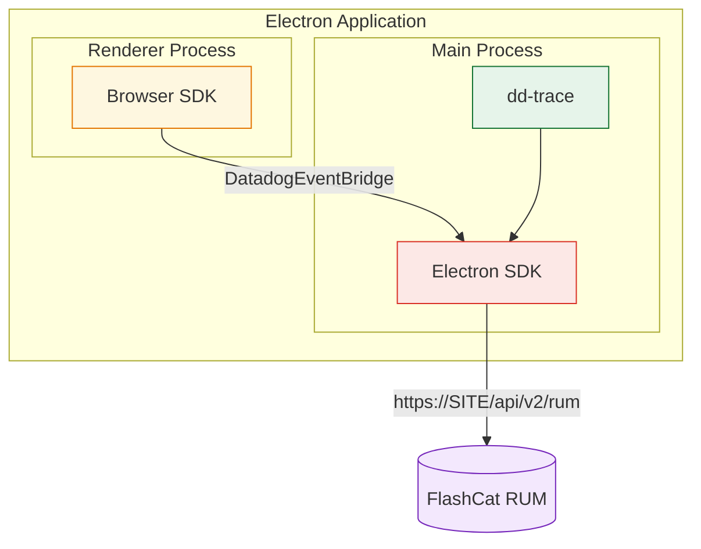

# FlashCat SDK for Electron

> Forked from [Datadog's Electron SDK](https://github.com/DataDog/electron-sdk) and rebranded to report to the FlashCat platform. Internal module/type names keep the `dd-`/`Datadog` prefix per the fork convention; the published package is `@flashcatcloud/electron-sdk` and events are sent to FlashCat RUM ingest.

Real User Monitoring for Electron applications.

> **Alpha (v0.X.X)** — This SDK is in early development. APIs may change between releases.

## Getting Started

### Prerequisites

- Electron 39+

### Install

```bash
yarn add @flashcatcloud/electron-sdk
# or
npm install @flashcatcloud/electron-sdk
```

### Setup

The Electron SDK uses dd-trace under the hood to monitor the main process and relies on the browser SDK to monitor renderer processes.



#### Main process setup

Import the instrumentation entry point **before** `electron` in your main process:

```ts
// src/main.ts
import '@flashcatcloud/electron-sdk/instrument';
import { app, BrowserWindow } from 'electron';
```

This initializes dd-trace and automatically instruments the needed APIs.

> dd-trace's own instrumentation telemetry — which reports to a Datadog agent, and unrelated to
> FlashCat RUM — is **disabled by default** by this entry point. Set
> `DD_INSTRUMENTATION_TELEMETRY_ENABLED=true` before startup if you specifically want it.

Then initialize the Electron SDK by calling `init` before creating any browser windows:

```ts
import { init } from '@flashcatcloud/electron-sdk';

await init({
  clientToken: '<CLIENT_TOKEN>',
  applicationId: '<APPLICATION_ID>',
  service: 'my-electron-app',
  site: 'browser.flashcat.cloud',
});
```

#### Renderer process setup

Renderer processes are monitored by the FlashCat Browser SDK. Install it in the pages loaded by
your renderer:

```bash
yarn add @flashcatcloud/browser-rum
```

```ts
// src/renderer.ts
import { flashcatRum } from '@flashcatcloud/browser-rum';

flashcatRum.init({
  applicationId: '<APPLICATION_ID>',
  clientToken: '<CLIENT_TOKEN>',
  site: 'browser.flashcat.cloud',
  service: 'my-electron-app',
  sessionSampleRate: 100,
  trackResources: true,
  trackLongTasks: true,
  trackUserInteractions: true,
});
```

No extra wiring is needed. The main-process SDK injects a preload script that exposes a
`DatadogEventBridge` global to every `BrowserWindow`; the Browser SDK auto-detects it and routes
its events through the main process instead of uploading them itself. Use the **same
`applicationId`** in both processes so the events land in one application.

> This works for pages loaded over `file://` as well as `http(s)://` — the injected bridge always
> allows the window's own host. Set `allowedWebViewHosts` only when you also want to accept events
> from **third-party** pages loaded in a `<webview>`/`BrowserView`.

##### How to find your events

Main-process and renderer-process events carry different `source` values — this matters when
querying or filtering in the console:

| Origin          | `source`   | `container.source` | `view.url`                |
| --------------- | ---------- | ------------------ | ------------------------- |
| Main process    | `electron` | _(absent)_         | `electron://main-process` |
| Renderer window | `browser`  | `electron`         | the page URL              |

To select everything produced by an Electron app, match `source:electron OR container.source:electron`.
Filtering on `source:electron` alone returns main-process events only.

#### Bundler plugins

dd-trace instruments `require('electron')` at runtime, which requires correct module loading order. The SDK provides bundler plugins to ensure this works in all environments:

**Vite** (including Electron Forge with Vite and electron-vite):

```ts
// vite config
import { datadogVitePlugin } from '@flashcatcloud/electron-sdk/vite-plugin';

export default defineConfig({
  plugins: [datadogVitePlugin()],
});
```

**Webpack** (including Electron Forge with Webpack):

```ts
// webpack config
const { DatadogWebpackPlugin } = require('@flashcatcloud/electron-sdk/webpack-plugin');

module.exports = {
  plugins: [new DatadogWebpackPlugin()],
};
```

**ESBuild**

```ts
// esbuild config
import { datadogEsbuildPlugin } from '@flashcatcloud/electron-sdk/esbuild-plugin';

await esbuild.build({
  plugins: [datadogEsbuildPlugin()],
});
```

## Available Features

- **Sessions** — Session-based event grouping
- **RUM Views** — One view per main process instance
- **RUM Errors** — Capture Node errors and crashes in main process
- **RUM Resources** — Capture RUM resources from main process network calls
- **Traces** — Capture traces for network calls, command execution, IPC messages on main process
- **Renderer Events** — Capture RUM events from renderer processes via the browser SDK
- **Operation Monitoring** _(experimental)_ — Track start / succeed / fail steps of critical user-facing workflows

### Operation Monitoring _(experimental)_

Operation Monitoring lets you track the lifecycle of critical user-facing workflows (login, checkout, file upload, video playback, …) by emitting paired `start` / `end` steps. The backend correlates the steps by `name` (and optional `operationKey`) and exposes them as a single Operation in the RUM UI.

> ⚗️ This API is in preview and the signatures may change before stable release.

```ts
import { startOperation, succeedOperation, failOperation } from '@flashcatcloud/electron-sdk';

// Simple operation
startOperation('checkout');
try {
  await runCheckout();
  succeedOperation('checkout');
} catch (error) {
  failOperation('checkout', 'error');
}

// Parallel operations sharing a name — distinguished by `operationKey`
startOperation('upload', { operationKey: 'profile_pic' });
startOperation('upload', { operationKey: 'cover_photo' });
succeedOperation('upload', { operationKey: 'profile_pic' });
failOperation('upload', 'abandoned', { operationKey: 'cover_photo' });
```

The renderer process keeps using `@flashcatcloud/browser-rum` directly (with the `feature_operation_vital` experimental flag enabled on its init). API signatures match exactly, so you can start an operation in one process and complete it in the other — the backend correlates steps by `name` + `operationKey`.

## API

### `init(config: InitConfiguration): Promise<boolean>`

Initialize the SDK. Returns `true` on success, `false` if configuration is invalid.

### `addError(error: unknown, options?: ErrorOptions): void`

Report a manually handled error.

```ts
import { addError } from '@flashcatcloud/electron-sdk';

try {
  riskyOperation();
} catch (error) {
  addError(error, { context: { component: 'sync' } });
}
```

### `startOperation(name: string, options?: FeatureOperationOptions): void`

Start a RUM Operation step. Pair every `startOperation` with exactly one `succeedOperation` or `failOperation`. Use `options.operationKey` to distinguish parallel operations sharing the same `name`.

> Note: `name` is required and should only contain letters, digits, `_`, `.`, `@`, `$`, `-`.

### `succeedOperation(name: string, options?: FeatureOperationOptions): void`

Record the successful completion of a RUM Operation. Pass the same `name` (and `operationKey`, if any) used to start it.

### `failOperation(name: string, failureReason: FailureReason, options?: FeatureOperationOptions): void`

Record the failure of a RUM Operation. `failureReason` must be one of `'error' | 'abandoned' | 'other'`.

```ts
type FailureReason = 'error' | 'abandoned' | 'other';

interface FeatureOperationOptions {
  /** Distinguishes parallel operations sharing the same `name`. */
  operationKey?: string;
  /** Free-form attributes merged into the event's `context`. */
  context?: Record<string, unknown>;
  /** Free-form description attached to `vital.description`. */
  description?: string;
}
```

> **Deprecated aliases.** The early-preview names `startFeatureOperation` / `succeedFeatureOperation` / `failFeatureOperation` are kept as deprecated aliases for backwards compatibility. They forward to the un-prefixed names above and emit a one-time runtime warning. They will be removed in the next major release — migrate to `startOperation` / `succeedOperation` / `failOperation`.

### Configuration Options

| Option                | Type                                     | Required | Default                  | Description                                                                                                                |
| --------------------- | ---------------------------------------- | -------- | ------------------------ | -------------------------------------------------------------------------------------------------------------------------- |
| `clientToken`         | `string`                                 | Yes      | —                        | FlashCat client token                                                                                                      |
| `applicationId`       | `string`                                 | Yes      | —                        | RUM application ID                                                                                                         |
| `site`                | `string`                                 | No       | `browser.flashcat.cloud` | Intake host, used verbatim — e.g. `browser.flashcat.cloud` (production), `jira.flashcat.cloud` (staging), or your own host |
| `service`             | `string`                                 | Yes      | —                        | Service name                                                                                                               |
| `env`                 | `string`                                 | No       | —                        | Application environment                                                                                                    |
| `version`             | `string`                                 | No       | —                        | Application version                                                                                                        |
| `telemetrySampleRate` | `number`                                 | No       | `20`                     | Telemetry sample rate (0–100)                                                                                              |
| `batchSize`           | `'SMALL' \| 'MEDIUM' \| 'LARGE'`         | No       | —                        | Batch size for event uploads                                                                                               |
| `uploadFrequency`     | `'RARE' \| 'NORMAL' \| 'FREQUENT'`       | No       | —                        | Upload frequency for event batches                                                                                         |
| `defaultPrivacyLevel` | `'mask' \| 'allow' \| 'mask-user-input'` | No       | `'mask'`                 | Default privacy level for renderer session replay                                                                          |
| `allowedWebViewHosts` | `string[]`                               | No       | `[]`                     | Extra hostnames allowed for the renderer bridge (the window's own host is always allowed)                                  |
| `proxy`               | `string`                                 | No       | —                        | Proxy URL to upload through instead of `site`. See [Self-hosted deployments](#self-hosted-deployments)                     |

### Self-hosted deployments

`site` is the intake host, used verbatim — there is no list of accepted hosts. Point it at your own
FlashCat instance:

```ts
await init({
  clientToken: '<CLIENT_TOKEN>',
  applicationId: '<APPLICATION_ID>',
  service: 'my-electron-app',
  site: 'rum.example.internal',
});
```

Events are then uploaded to `https://rum.example.internal/api/v2/rum`.

> **The scheme is always `https://`.** It is hardcoded in the URL template, so an intake served over
> plain **HTTP**, or one that is not at the root of its host, cannot be reached through `site` — use
> `proxy` for those.

Set `proxy` to upload through an endpoint of your own instead. When `proxy` is set, `site` no longer
takes part in building the upload URL:

```ts
await init({
  clientToken: '<CLIENT_TOKEN>',
  applicationId: '<APPLICATION_ID>',
  service: 'my-electron-app',
  proxy: 'http://rum.example.internal:8080/forward',
});
```

The SDK then POSTs to `<proxy>?ddforward=%2Fapi%2Fv2%2Frum`. Your endpoint must forward the request
body to `/api/v2/rum` on your FlashCat instance, preserving the `DD-API-KEY` and `Content-Type`
headers.
