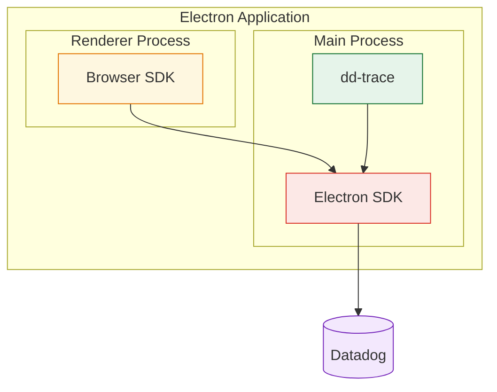

# Datadog SDK for Electron

Real User Monitoring for Electron applications.

> **Alpha (v0.X.X)** — This SDK is in early development. APIs may change between releases.

## Getting Started

### Prerequisites

- Electron 39+

### Install

```bash
yarn add @datadog/electron-sdk
# or
npm install @datadog/electron-sdk
```

### Setup

The Electron SDK uses dd-trace under the hood to monitor the main process and relies on the browser SDK to monitor renderer processes.



#### Main process setup

Import the instrumentation entry point **before** `electron` in your main process:

```ts
// src/main.ts
import '@datadog/electron-sdk/instrument';
import { app, BrowserWindow } from 'electron';
```

This initializes dd-trace and automatically instruments the needed APIs.

Then initialize the Electron SDK by calling `init` before creating any browser windows:

```ts
import { init } from '@datadog/electron-sdk';

await init({
  clientToken: '<CLIENT_TOKEN>',
  applicationId: '<APPLICATION_ID>',
  service: 'my-electron-app',
  site: 'datadoghq.com',
});
```

#### Renderer process setup

In order to monitor the renderer process, you must [set up the Browser SDK](https://docs.datadoghq.com/real_user_monitoring/application_monitoring/browser/setup/) in pages loaded by the renderer.

#### Bundler plugins

dd-trace instruments `require('electron')` at runtime, which requires correct module loading order. The SDK provides bundler plugins to ensure this works in all environments:

**Vite** (including Electron Forge with Vite and electron-vite):

```ts
// vite config
import { datadogVitePlugin } from '@datadog/electron-sdk/vite-plugin';

export default defineConfig({
  plugins: [datadogVitePlugin()],
});
```

**Webpack** (including Electron Forge with Webpack):

```ts
// webpack config
const { DatadogWebpackPlugin } = require('@datadog/electron-sdk/webpack-plugin');

module.exports = {
  plugins: [new DatadogWebpackPlugin()],
};
```

**ESBuild**

```ts
// esbuild config
import { datadogEsbuildPlugin } from '@datadog/electron-sdk/esbuild-plugin';

await esbuild.build({
  plugins: [datadogEsbuildPlugin()],
});
```

## Available Features

- **Sessions** — Session-based event grouping
- **RUM Views** — One view per main process instance
- **RUM Errors** — Capture Node errors and crashes in main process
- **RUM Resources** — Capture RUM resources from main process network calls
- **Traces** — Capture traces for network calls, command execution, IPC messages on main process
- **Renderer Events** — Capture RUM events from renderer processes via the browser SDK

## API

### `init(config: InitConfiguration): Promise<boolean>`

Initialize the SDK. Returns `true` on success, `false` if configuration is invalid.

### `addError(error: unknown, options?: ErrorOptions): void`

Report a manually handled error.

```ts
import { addError } from '@datadog/electron-sdk';

try {
  riskyOperation();
} catch (error) {
  addError(error, { context: { component: 'sync' } });
}
```

### Configuration Options

| Option                | Type                                     | Required | Default  | Description                                                                                                                        |
| --------------------- | ---------------------------------------- | -------- | -------- | ---------------------------------------------------------------------------------------------------------------------------------- |
| `clientToken`         | `string`                                 | Yes      | —        | Datadog client token                                                                                                               |
| `applicationId`       | `string`                                 | Yes      | —        | RUM application ID                                                                                                                 |
| `site`                | `string`                                 | Yes      | —        | Datadog site (e.g. `datadoghq.com`, `datadoghq.eu`, `us3.datadoghq.com`, `us5.datadoghq.com`, `ap1.datadoghq.com`, `ddog-gov.com`) |
| `service`             | `string`                                 | Yes      | —        | Service name                                                                                                                       |
| `env`                 | `string`                                 | No       | —        | Application environment                                                                                                            |
| `version`             | `string`                                 | No       | —        | Application version                                                                                                                |
| `telemetrySampleRate` | `number`                                 | No       | `20`     | Telemetry sample rate (0–100)                                                                                                      |
| `batchSize`           | `'SMALL' \| 'MEDIUM' \| 'LARGE'`         | No       | —        | Batch size for event uploads                                                                                                       |
| `uploadFrequency`     | `'RARE' \| 'NORMAL' \| 'FREQUENT'`       | No       | —        | Upload frequency for event batches                                                                                                 |
| `defaultPrivacyLevel` | `'mask' \| 'allow' \| 'mask-user-input'` | No       | `'mask'` | Default privacy level for renderer session replay                                                                                  |
| `allowedWebViewHosts` | `string[]`                               | No       | `[]`     | Hostnames allowed for the renderer bridge                                                                                          |
