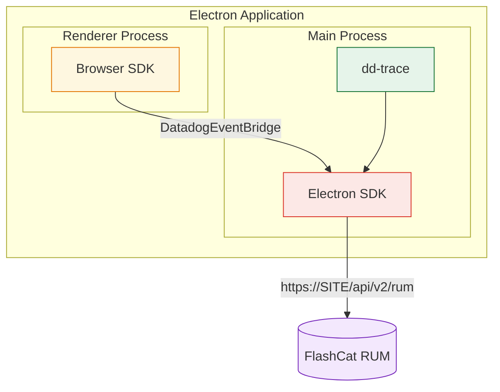

# FlashCat SDK for Electron

> Forked from [Datadog's Electron SDK](https://github.com/DataDog/electron-sdk) and rebranded to report to the FlashCat platform. Internal module/type names keep the `dd-`/`Datadog` prefix per the fork convention; the published package is `@flashcatcloud/electron-sdk` and events are sent to FlashCat RUM ingest.

Real User Monitoring for Electron applications.

> **Alpha (v0.X.X)** — This SDK is in early development. APIs may change between releases.

## Getting Started

### Prerequisites

- Electron 39+

### Install

```bash
yarn add @flashcatcloud/electron-sdk
# or
npm install @flashcatcloud/electron-sdk
```

### Setup

The Electron SDK uses dd-trace under the hood to monitor the main process and relies on the browser SDK to monitor renderer processes.



#### Main process setup

Import the instrumentation entry point **before** `electron` in your main process:

```ts
// src/main.ts
import '@flashcatcloud/electron-sdk/instrument';
import { app, BrowserWindow } from 'electron';
```

This initializes dd-trace and automatically instruments the needed APIs.

> dd-trace's own instrumentation telemetry — which reports to a Datadog agent, and unrelated to
> FlashCat RUM — is **disabled by default** by this entry point. Set
> `DD_INSTRUMENTATION_TELEMETRY_ENABLED=true` before startup if you specifically want it.

Then initialize the Electron SDK by calling `init` before creating any browser windows:

```ts
import { init } from '@flashcatcloud/electron-sdk';

await init({
  clientToken: '<CLIENT_TOKEN>',
  applicationId: '<APPLICATION_ID>',
  service: 'my-electron-app',
  site: 'browser.flashcat.cloud',
});
```

#### Renderer process setup

Renderer processes are monitored by the FlashCat Browser SDK. Install it in the pages loaded by
your renderer:

```bash
yarn add @flashcatcloud/browser-rum@^0.0.7
```

> **`0.0.7` is a minimum, not a suggestion.** Earlier versions have no `sessionReplayDirectUpload`,
> and the Browser SDK ignores options it does not know — so Session Replay would silently record
> nothing, with no error to tell you why. See [Session Replay](#session-replay) below.

```ts
// src/renderer.ts
import { flashcatRum } from '@flashcatcloud/browser-rum';

flashcatRum.init({
  applicationId: '<APPLICATION_ID>',
  clientToken: '<CLIENT_TOKEN>',
  site: 'browser.flashcat.cloud',
  service: 'my-electron-app',
  sessionSampleRate: 100,
  trackResources: true,
  trackLongTasks: true,
  trackUserInteractions: true,
});
```

No extra wiring is needed for RUM. The main-process SDK injects a preload script that exposes a
`DatadogEventBridge` global to every `BrowserWindow`; the Browser SDK auto-detects it and routes
its events through the main process instead of uploading them itself. Use the **same
`applicationId`** in both processes so the events land in one application.

> This works for pages loaded over `file://` as well as `http(s)://` — the injected bridge always
> allows the window's own host. Set `allowedWebViewHosts` only when you also want to accept events
> from **third-party** pages loaded in a `<webview>`/`BrowserView`.

##### Session Replay

Session Replay is the one feature the bridge does **not** carry. Seeing a bridge, the Browser SDK
hands recording over to the host application by default — and the main process does not record, so
nothing is captured at all. Add both of these to the renderer's `init` to keep the recorder in the
page, uploading straight to the intake:

```ts
flashcatRum.init({
  // ...
  sessionReplaySampleRate: 100, // defaults to 0 — the option alone records nothing
  sessionReplayDirectUpload: true, // requires @flashcatcloud/browser-rum >= 0.0.7
});
```

> **Check the renderer's `@flashcatcloud/browser-rum` version before assuming this is wired up.**
> `sessionReplayDirectUpload` landed in `0.0.7`. On anything earlier the option is simply an
> unknown key: the Browser SDK drops it without complaint, hands recording to the host as usual,
> and captures nothing. There is no warning in the console and no error at the intake — the only
> symptom is a session with no replay.

Segments then bypass the main process entirely, so they need a Content Security Policy that allows
`worker-src blob:` and the intake origin, and they do not share the main process's disk-backed
retry.

##### Identifiers the bridge answers

`window.DatadogEventBridge` exposes the two identifiers the main process owns, so a renderer can
attribute anything it uploads itself to the same session and device:

| Method             | Returns                                                                                               |
| ------------------ | ----------------------------------------------------------------------------------------------------- |
| `getSessionId()`   | Id of the session the main process considers active, or `''` while none is (expired, not renewed yet) |
| `getAnonymousId()` | Device-scoped id, generated once and kept under `app.getPath('userData')` across restarts             |

Both answer synchronously and without IPC: the anonymous id is delivered when the bridge is set up,
and the main process pushes every session change to open renderers.

##### How to find your events

Main-process and renderer-process events carry different `source` values — this matters when
querying or filtering in the console:

| Origin          | `source`   | `container.source` | `view.url`                |
| --------------- | ---------- | ------------------ | ------------------------- |
| Main process    | `electron` | _(absent)_         | `electron://main-process` |
| Renderer window | `browser`  | `electron`         | the page URL              |

To select everything produced by an Electron app, match `source:electron OR container.source:electron`.
Filtering on `source:electron` alone returns main-process events only.

#### Bundler plugins

dd-trace instruments `require('electron')` at runtime, which requires correct module loading order. The SDK provides bundler plugins to ensure this works in all environments:

**Vite** (including Electron Forge with Vite and electron-vite):

```ts
// vite config
import { datadogVitePlugin } from '@flashcatcloud/electron-sdk/vite-plugin';

export default defineConfig({
  plugins: [datadogVitePlugin()],
});
```

**Webpack** (including Electron Forge with Webpack):

```ts
// webpack config
const { DatadogWebpackPlugin } = require('@flashcatcloud/electron-sdk/webpack-plugin');

module.exports = {
  plugins: [new DatadogWebpackPlugin()],
};
```

**ESBuild**

```ts
// esbuild config
import { datadogEsbuildPlugin } from '@flashcatcloud/electron-sdk/esbuild-plugin';

await esbuild.build({
  plugins: [datadogEsbuildPlugin()],
});
```

## Available Features

- **Sessions** — Session-based event grouping
- **RUM Views** — One view per main process instance
- **RUM Errors** — Capture Node errors and crashes in main process, with sourcemap-ready stacks
- **RUM Resources** — Capture RUM resources from main process network calls
- **Traces** — Capture traces for network calls, command execution, IPC messages on main process
- **Renderer Events** — Capture RUM events from renderer processes via the browser SDK
- **Operation Monitoring** _(experimental)_ — Track start / succeed / fail steps of critical user-facing workflows

### Error stacks and sourcemaps

Errors reported from the **main process** — uncaught exceptions, unhandled rejections, and
`addError()` — carry a stack in the same shape the renderer produces. In **both** processes, every
frame under your application root is rewritten to `app:///<path relative to the app root>`:

```
Error: something went wrong
  at handleClick @ app:///dist/main.js:97:15
  at <anonymous> @ process.processTimers (node:internal/timers:541:7)
```

The raw frame URL is the runtime _installation_ path — which your build cannot know:

| Platform         | Raw frame URL                                                      |
| ---------------- | ------------------------------------------------------------------ |
| macOS            | `/Applications/MyApp.app/Contents/Resources/app.asar/dist/main.js` |
| Windows          | `C:/Users/<user>/AppData/Local/Programs/MyApp/…/dist/main.js`      |
| Linux (AppImage) | `/tmp/.mount_XXXXXX/resources/app.asar/dist/main.js`               |

Sourcemaps uploaded against those paths would only ever match on the machine the paths happened to
describe. Anchoring each path on the application root strips the machine-specific part and leaves
one that is stable across installs and platforms. This is the same `app:///` scheme the Sentry
Electron SDK uses, and it works the same for asar-packaged and unpackaged (development) builds.

Upload the sourcemaps for your bundle with a prefix matching the rewritten path — `app:///dist/…`
resolves to `/dist/…`, so the prefix is `/dist`:

```sh
flashcat-cli sourcemaps upload ./dist \
  --service my-app \
  --release-version 1.2.3 \
  --minified-path-prefix /dist
```

> Pass the **path**, `/dist` — not `app:///dist`. The intake keys sourcemaps by URL path only, and
> the CLI rejects a prefix that is neither an `http(s)` URL nor an absolute path.

Anything that is not a path under your application root is left exactly as it is: `node:internal/…`
frames (kept because they are useful to read, skipped during un-minification), `http(s)` URLs,
native modules under `app.asar.unpacked`, and paths your own code has already normalized — so a
renderer `beforeSend` that already rewrites stacks keeps working unchanged. `view.url` is left
alone as well: it identifies the page, not the code.

Set `normalizeStackPaths: false` to report the raw absolute paths instead.

#### Custom path mapping

When one application root cannot express the mapping, `normalizeStackPath` rewrites a frame's path
before the built-in normalization runs. Return `undefined` to fall through to `app:///`, or a
string to use verbatim.

A build that emits to `<app root>/public/dist` but uploads its sourcemaps under `/dist` — so the
intermediate `public/` segment has to be swallowed — while a linked package keeps its path relative
to the application root:

```ts
init({
  // …
  normalizeStackPath: (absolutePath) => {
    const emitted = /\/public(\/dist\/.+)$/.exec(absolutePath);
    if (emitted) {
      return emitted[1]; // …/public/dist/renderer.js → /dist/renderer.js
    }
    const linked = /(\/node_modules\/@acme\/widgets\/dist\/.+)$/.exec(absolutePath);
    return linked ? linked[1] : undefined; // everything else → built-in app:///
  },
});
```

It applies to main-process and renderer frames alike. A callback that throws is reported as an SDK
error and that frame falls back to the built-in behaviour, so a faulty callback can never take
error reporting down.

> Native crash stacks (from `crashReporter` minidumps) use a different, address-based format and are
> unaffected by this. They are reported as-is; symbolication of native frames is not supported yet.

### Operation Monitoring _(experimental)_

Operation Monitoring lets you track the lifecycle of critical user-facing workflows (login, checkout, file upload, video playback, …) by emitting paired `start` / `end` steps. The backend correlates the steps by `name` (and optional `operationKey`) and exposes them as a single Operation in the RUM UI.

> ⚗️ This API is in preview and the signatures may change before stable release.

```ts
import { startOperation, succeedOperation, failOperation } from '@flashcatcloud/electron-sdk';

// Simple operation
startOperation('checkout');
try {
  await runCheckout();
  succeedOperation('checkout');
} catch (error) {
  failOperation('checkout', 'error');
}

// Parallel operations sharing a name — distinguished by `operationKey`
startOperation('upload', { operationKey: 'profile_pic' });
startOperation('upload', { operationKey: 'cover_photo' });
succeedOperation('upload', { operationKey: 'profile_pic' });
failOperation('upload', 'abandoned', { operationKey: 'cover_photo' });
```

The renderer process keeps using `@flashcatcloud/browser-rum` directly (with the `feature_operation_vital` experimental flag enabled on its init). API signatures match exactly, so you can start an operation in one process and complete it in the other — the backend correlates steps by `name` + `operationKey`.

## API

### `init(config: InitConfiguration): Promise<boolean>`

Initialize the SDK. Returns `true` on success, `false` if configuration is invalid.

### `addError(error: unknown, options?: ErrorOptions): void`

Report a manually handled error.

```ts
import { addError } from '@flashcatcloud/electron-sdk';

try {
  riskyOperation();
} catch (error) {
  addError(error, { context: { component: 'sync' } });
}
```

### `startOperation(name: string, options?: FeatureOperationOptions): void`

Start a RUM Operation step. Pair every `startOperation` with exactly one `succeedOperation` or `failOperation`. Use `options.operationKey` to distinguish parallel operations sharing the same `name`.

> Note: `name` is required and should only contain letters, digits, `_`, `.`, `@`, `$`, `-`.

### `succeedOperation(name: string, options?: FeatureOperationOptions): void`

Record the successful completion of a RUM Operation. Pass the same `name` (and `operationKey`, if any) used to start it.

### `failOperation(name: string, failureReason: FailureReason, options?: FeatureOperationOptions): void`

Record the failure of a RUM Operation. `failureReason` must be one of `'error' | 'abandoned' | 'other'`.

```ts
type FailureReason = 'error' | 'abandoned' | 'other';

interface FeatureOperationOptions {
  /** Distinguishes parallel operations sharing the same `name`. */
  operationKey?: string;
  /** Free-form attributes merged into the event's `context`. */
  context?: Record<string, unknown>;
  /** Free-form description attached to `vital.description`. */
  description?: string;
}
```

> **Deprecated aliases.** The early-preview names `startFeatureOperation` / `succeedFeatureOperation` / `failFeatureOperation` are kept as deprecated aliases for backwards compatibility. They forward to the un-prefixed names above and emit a one-time runtime warning. They will be removed in the next major release — migrate to `startOperation` / `succeedOperation` / `failOperation`.

### Configuration Options

| Option                        | Type                                     | Required | Default                  | Description                                                                                                                            |
| ----------------------------- | ---------------------------------------- | -------- | ------------------------ | -------------------------------------------------------------------------------------------------------------------------------------- |
| `clientToken`                 | `string`                                 | Yes      | —                        | FlashCat client token                                                                                                                  |
| `applicationId`               | `string`                                 | Yes      | —                        | RUM application ID                                                                                                                     |
| `site`                        | `string`                                 | No       | `browser.flashcat.cloud` | Intake host, used verbatim — e.g. `browser.flashcat.cloud` (production), `jira.flashcat.cloud` (staging), or your own host             |
| `service`                     | `string`                                 | Yes      | —                        | Service name                                                                                                                           |
| `env`                         | `string`                                 | No       | —                        | Application environment                                                                                                                |
| `version`                     | `string`                                 | No       | —                        | Application version                                                                                                                    |
| `telemetrySampleRate`         | `number`                                 | No       | `20`                     | Telemetry sample rate (0–100)                                                                                                          |
| `batchSize`                   | `'SMALL' \| 'MEDIUM' \| 'LARGE'`         | No       | —                        | Batch size for event uploads                                                                                                           |
| `uploadFrequency`             | `'RARE' \| 'NORMAL' \| 'FREQUENT'`       | No       | —                        | Upload frequency for event batches                                                                                                     |
| `defaultPrivacyLevel`         | `'mask' \| 'allow' \| 'mask-user-input'` | No       | `'mask'`                 | Default privacy level for renderer session replay                                                                                      |
| `allowedWebViewHosts`         | `string[]`                               | No       | `[]`                     | Extra hostnames allowed for the renderer bridge (the window's own host is always allowed)                                              |
| `proxy`                       | `string`                                 | No       | —                        | Proxy URL to upload through instead of `site`. See [Self-hosted deployments](#self-hosted-deployments)                                 |
| `normalizeStackPaths`         | `boolean`                                | No       | `true`                   | Rewrite stack frame paths to `app:///<path relative to the app root>`. See [Error stacks and sourcemaps](#error-stacks-and-sourcemaps) |
| `correctPrewarmedViewTimings` | `boolean`                                | No       | `true`                   | Rebase FCP/LCP of pre-warmed windows onto the moment they became visible. See [Pre-warmed windows](#pre-warmed-windows)                |

### Pre-warmed windows

Applications commonly pre-create a renderer — `new BrowserWindow({ show: false })` — and navigate
it long before the user ever sees it. Electron keeps painting such a window
(`paintWhenInitiallyHidden` defaults to `true`), so the page reports `document.visibilityState ===
'visible'` and the browser SDK's usual "page was in the background" guard never trips. An
application that renders its first screen when the window is shown therefore reports an FCP and LCP
inflated by the entire pre-warm interval — measured at 8.2s for a window shown 8s after creation.
LCP is affected more widely than FCP: it keeps updating until the first user interaction, which
cannot happen while the window is hidden, so a large element appearing at `show()` becomes the LCP
even when FCP itself looks healthy.

The SDK corrects this the way the Paint Timing spec handles prerendered pages — by subtracting the
activation instant, which the main process observes from the window lifecycle:

```
activationStart = max(0, firstVisibleAt − viewStart)
metric'         = max(0, metric − activationStart)
```

Only the first view of a document (`loading_type: initial_load`) is eligible, and only windows the
SDK saw being created. Ordinary windows are anchored on their creation instant, so their metrics are
never rewritten. A window that has not been shown at all reports no FCP/LCP rather than a
meaningless one. `WebContentsView` and `<webview>` have no window lifecycle to observe and are left
untouched.

Set `correctPrewarmedViewTimings: false` to report the raw document-level timings instead.

### Self-hosted deployments

`site` is the intake host, used verbatim — there is no list of accepted hosts. Point it at your own
FlashCat instance:

```ts
await init({
  clientToken: '<CLIENT_TOKEN>',
  applicationId: '<APPLICATION_ID>',
  service: 'my-electron-app',
  site: 'rum.example.internal',
});
```

Events are then uploaded to `https://rum.example.internal/api/v2/rum`.

> **The scheme is always `https://`.** It is hardcoded in the URL template, so an intake served over
> plain **HTTP**, or one that is not at the root of its host, cannot be reached through `site` — use
> `proxy` for those.

Set `proxy` to upload through an endpoint of your own instead. When `proxy` is set, `site` no longer
takes part in building the upload URL:

```ts
await init({
  clientToken: '<CLIENT_TOKEN>',
  applicationId: '<APPLICATION_ID>',
  service: 'my-electron-app',
  proxy: 'http://rum.example.internal:8080/forward',
});
```

The SDK then POSTs to `<proxy>?ddforward=%2Fapi%2Fv2%2Frum`. Your endpoint must forward the request
body to `/api/v2/rum` on your FlashCat instance, preserving the `DD-API-KEY` and `Content-Type`
headers.
