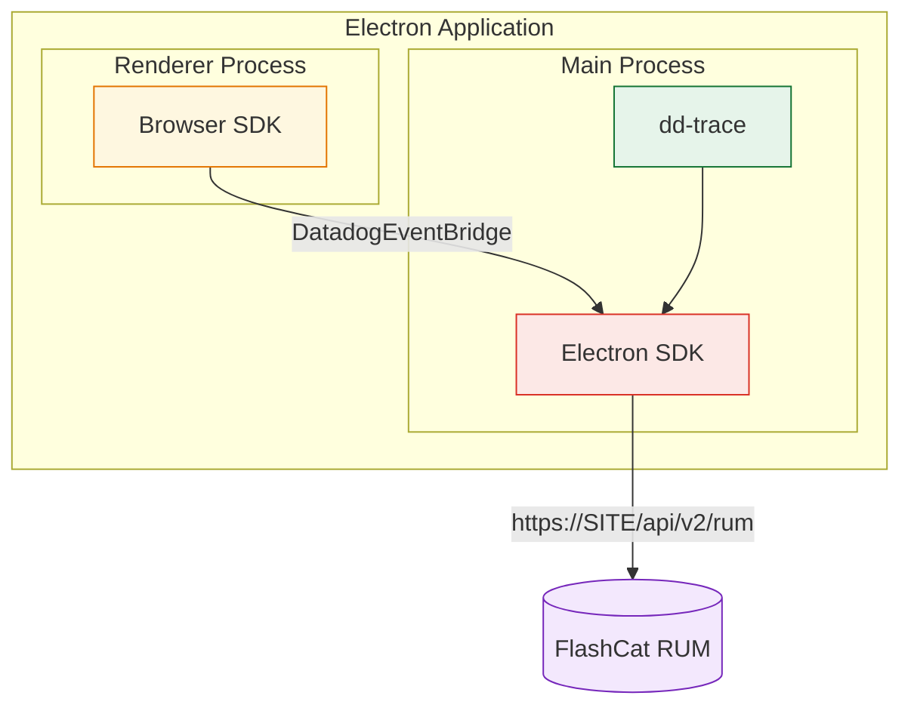

# FlashCat SDK for Electron

> Forked from [Datadog's Electron SDK](https://github.com/DataDog/electron-sdk) and rebranded to report to the FlashCat platform. Internal module/type names keep the `dd-`/`Datadog` prefix per the fork convention; the published package is `@flashcatcloud/electron-sdk` and events are sent to FlashCat RUM ingest.

Real User Monitoring for Electron applications.

> **Alpha (v0.X.X)** — This SDK is in early development. APIs may change between releases.

## Getting Started

### Prerequisites

- Electron 30+ — on Electron 30 to 36, requests made through Electron's own `net` module produce no `resource` events, because dd-trace only instruments it from Electron 37. Node `http`/`https` and the global `fetch` are traced on every supported version.

### Install

```bash
yarn add @flashcatcloud/electron-sdk
# or
npm install @flashcatcloud/electron-sdk
```

### Setup

The Electron SDK uses dd-trace under the hood to monitor the main process and relies on the browser SDK to monitor renderer processes.


```mermaid
graph TB
    subgraph Electron Application
        subgraph Renderer Process
            BP[Browser SDK]
        end

        subgraph Main Process
            DDT[dd-trace]
            SDK[Electron SDK]
        end
    end

    DD[(FlashCat RUM)]
    BP -->|DatadogEventBridge| SDK
    DDT --> SDK
    SDK -->|https://SITE/api/v2/rum| DD

    %% Styling
    classDef sdk fill:#fce8e6,stroke:#d93025
    classDef trace fill:#e6f4ea,stroke:#137333
    classDef browser fill:#fef7e0,stroke:#e37400
    classDef ext fill:#f3e8fd,stroke:#7627bb

    class BP browser
    class DDT trace
    class SDK sdk
    class DD ext
```

#### Main process setup

Import the instrumentation entry point **before** `electron` in your main process:

```ts
// src/main.ts
import '@flashcatcloud/electron-sdk/instrument';
import { app, BrowserWindow } from 'electron';
```

This initializes dd-trace and automatically instruments the needed APIs.

> dd-trace's own instrumentation telemetry — which reports to a Datadog agent, and unrelated to
> FlashCat RUM — is **disabled by default** by this entry point. Set
> `DD_INSTRUMENTATION_TELEMETRY_ENABLED=true` before startup if you specifically want it.

Then initialize the Electron SDK by calling `init` before creating any browser windows:

```ts
import { init } from '@flashcatcloud/electron-sdk';

await init({
  clientToken: '<CLIENT_TOKEN>',
  applicationId: '<APPLICATION_ID>',
  service: 'my-electron-app',
  site: 'browser.flashcat.cloud',
});
```

#### Renderer process setup

Renderer processes are monitored by the FlashCat Browser SDK. Install it in the pages loaded by
your renderer:

```bash
yarn add @flashcatcloud/browser-rum@^0.0.7
```

> **`0.0.7` is a minimum, not a suggestion.** Earlier versions have no `sessionReplayDirectUpload`,
> and the Browser SDK ignores options it does not know — so Session Replay would silently record
> nothing, with no error to tell you why. See [Session Replay](#session-replay) below.

```ts
// src/renderer.ts
import { flashcatRum } from '@flashcatcloud/browser-rum';

flashcatRum.init({
  applicationId: '<APPLICATION_ID>',
  clientToken: '<CLIENT_TOKEN>',
  site: 'browser.flashcat.cloud',
  service: 'my-electron-app',
  sessionSampleRate: 100,
  trackResources: true,
  trackLongTasks: true,
  trackUserInteractions: true,
});
```

No extra wiring is needed for RUM. The main-process SDK injects a preload script that exposes a
`DatadogEventBridge` global to every `BrowserWindow`; the Browser SDK auto-detects it and routes
its events through the main process instead of uploading them itself. Use the **same
`applicationId`** in both processes so the events land in one application.

> This works for pages loaded over `file://` as well as `http(s)://` — the injected bridge always
> allows the window's own host. Set `allowedWebViewHosts` only when you also want to accept events
> from **third-party** pages loaded in a `<webview>`/`BrowserView`.

##### Session Replay

Session Replay is the one feature the bridge does **not** carry. Seeing a bridge, the Browser SDK
hands recording over to the host application by default — and the main process does not record, so
nothing is captured at all. Add both of these to the renderer's `init` to keep the recorder in the
page, uploading straight to the intake:

```ts
flashcatRum.init({
  // ...
  sessionReplaySampleRate: 100, // defaults to 0 — the option alone records nothing
  sessionReplayDirectUpload: true, // requires @flashcatcloud/browser-rum >= 0.0.7
});
```

> **Check the renderer's `@flashcatcloud/browser-rum` version before assuming this is wired up.**
> `sessionReplayDirectUpload` landed in `0.0.7`. On anything earlier the option is simply an
> unknown key: the Browser SDK drops it without complaint, hands recording to the host as usual,
> and captures nothing. There is no warning in the console and no error at the intake — the only
> symptom is a session with no replay.

Segments then bypass the main process entirely, so they need a Content Security Policy that allows
`worker-src blob:` and the intake origin, and they do not share the main process's disk-backed
retry.

##### Identifiers the bridge answers

`window.DatadogEventBridge` exposes the identifiers the main process owns, so a renderer can
attribute anything it uploads itself to the same session, device and user:

| Method             | Returns                                                                                               |
| ------------------ | ----------------------------------------------------------------------------------------------------- |
| `getSessionId()`   | Id of the session the main process considers active, or `''` while none is (expired, not renewed yet) |
| `getAnonymousId()` | Device-scoped id, generated once and kept under `app.getPath('userData')` across restarts             |
| `getUser()`        | Identity set through [`setUser`](#setuseruser-user-void) as JSON, or `'{}'` when nobody is logged in  |

All three answer synchronously and without IPC: the anonymous id is delivered when the bridge is set
up, and the main process pushes every session and identity change to open renderers.

Renderer events do not need `getUser()` — the main process stamps the identity on them as they pass
through. It is there for what a renderer uploads itself, such as Session Replay segments.

##### How to find your events

Main-process and renderer-process events carry different `source` values — this matters when
querying or filtering in the console:

| Origin          | `source`   | `container.source` | `view.url`                |
| --------------- | ---------- | ------------------ | ------------------------- |
| Main process    | `electron` | _(absent)_         | `electron://main-process` |
| Renderer window | `browser`  | `electron`         | the page URL              |

To select everything produced by an Electron app, match `source:electron OR container.source:electron`.
Filtering on `source:electron` alone returns main-process events only.

#### Bundler plugins

dd-trace instruments `require('electron')` at runtime, which requires correct module loading order. The SDK provides bundler plugins to ensure this works in all environments:

**Vite** (including Electron Forge with Vite and electron-vite):

```ts
// vite config
import { datadogVitePlugin } from '@flashcatcloud/electron-sdk/vite-plugin';

export default defineConfig({
  plugins: [datadogVitePlugin()],
});
```

**Webpack** (including Electron Forge with Webpack):

```ts
// webpack config
const { DatadogWebpackPlugin } = require('@flashcatcloud/electron-sdk/webpack-plugin');

module.exports = {
  plugins: [new DatadogWebpackPlugin()],
};
```

**ESBuild**

```ts
// esbuild config
import { datadogEsbuildPlugin } from '@flashcatcloud/electron-sdk/esbuild-plugin';

await esbuild.build({
  plugins: [datadogEsbuildPlugin()],
});
```

## Available Features

- **Sessions** — Session-based event grouping, with [sampling](#sampling) and error-session capture
- **RUM Views** — One view per main process instance
- **RUM Errors** — Capture Node errors and crashes in main process, with sourcemap-ready stacks
- **RUM Resources** — Capture RUM resources from main process network calls
- **Traces** — Capture traces for network calls, command execution, IPC messages on main process
- **Renderer Events** — Capture RUM events from renderer processes via the browser SDK

### Error stacks and sourcemaps

Errors reported from the **main process** — uncaught exceptions, unhandled rejections, and
`addError()` — carry a stack in the same shape the renderer produces. In **both** processes, every
frame under your application root is rewritten to `app:///<path relative to the app root>`:

```
Error: something went wrong
  at handleClick @ app:///dist/main.js:97:15
  at <anonymous> @ process.processTimers (node:internal/timers:541:7)
```

The raw frame URL is the runtime _installation_ path — which your build cannot know:

| Platform         | Raw frame URL                                                      |
| ---------------- | ------------------------------------------------------------------ |
| macOS            | `/Applications/MyApp.app/Contents/Resources/app.asar/dist/main.js` |
| Windows          | `C:/Users/<user>/AppData/Local/Programs/MyApp/…/dist/main.js`      |
| Linux (AppImage) | `/tmp/.mount_XXXXXX/resources/app.asar/dist/main.js`               |

Sourcemaps uploaded against those paths would only ever match on the machine the paths happened to
describe. Anchoring each path on the application root strips the machine-specific part and leaves
one that is stable across installs and platforms. This is the same `app:///` scheme the Sentry
Electron SDK uses, and it works the same for asar-packaged and unpackaged (development) builds.

Upload the sourcemaps for your bundle with a prefix matching the rewritten path — `app:///dist/…`
resolves to `/dist/…`, so the prefix is `/dist`:

```sh
flashcat-cli sourcemaps upload ./dist \
  --service my-app \
  --release-version 1.2.3 \
  --minified-path-prefix /dist
```

> Pass the **path**, `/dist` — not `app:///dist`. The intake keys sourcemaps by URL path only, and
> the CLI rejects a prefix that is neither an `http(s)` URL nor an absolute path.

Anything that is not a path under your application root is left exactly as it is: `node:internal/…`
frames (kept because they are useful to read, skipped during un-minification), `http(s)` URLs,
native modules under `app.asar.unpacked`, and paths your own code has already normalized — so a
renderer `beforeSend` that already rewrites stacks keeps working unchanged. `view.url` is left
alone as well: it identifies the page, not the code.

Set `normalizeStackPaths: false` to report the raw absolute paths instead.

#### Custom path mapping

When one application root cannot express the mapping, `normalizeStackPath` rewrites a frame's path
before the built-in normalization runs. Return `undefined` to fall through to `app:///`, or a
string to use verbatim.

A build that emits to `<app root>/public/dist` but uploads its sourcemaps under `/dist` — so the
intermediate `public/` segment has to be swallowed — while a linked package keeps its path relative
to the application root:

```ts
init({
  // …
  normalizeStackPath: (absolutePath) => {
    const emitted = /\/public(\/dist\/.+)$/.exec(absolutePath);
    if (emitted) {
      return emitted[1]; // …/public/dist/renderer.js → /dist/renderer.js
    }
    const linked = /(\/node_modules\/@acme\/widgets\/dist\/.+)$/.exec(absolutePath);
    return linked ? linked[1] : undefined; // everything else → built-in app:///
  },
});
```

It applies to main-process and renderer frames alike. A callback that throws is reported as an SDK
error and that frame falls back to the built-in behaviour, so a faulty callback can never take
error reporting down.

> Native crash stacks (from `crashReporter` minidumps) use a different, address-based format and are
> unaffected by this. They are reported as-is; symbolication of native frames is not supported yet.

## API

### `init(config: InitConfiguration): Promise<boolean>`

Initialize the SDK. Returns `true` on success, `false` if configuration is invalid.

### `addError(error: unknown, options?: ErrorOptions): void`

Report a manually handled error.

```ts
import { addError } from '@flashcatcloud/electron-sdk';

try {
  riskyOperation();
} catch (error) {
  addError(error, { context: { component: 'sync' } });
}
```

### `setUser(user: User): void`

Identify the logged-in user. The identity is attached to every subsequent main-process event, and
to the renderer events that reach the main process over the bridge.

```ts
import { setUser, getUser, clearUser } from '@flashcatcloud/electron-sdk';

setUser({ id: 'user-123', name: 'Alice', email: 'alice@example.com' });

// Later, when the user logs out:
clearUser();
```

```ts
interface User {
  /** Required. */
  id: string;
  name?: string;
  email?: string;
}
```

`id` is required: a call without one is ignored with a warning, as is one whose `name` or `email` is
not a string — a half-applied identity is harder to notice than none at all. Only `id`, `name` and
`email` are read; any other property is dropped.

This does **not** touch `usr.anonymous_id`. The two identifiers coexist by design: the anonymous id
is device-scoped and stable across logins, and unique users are counted off it first. Before the
first `setUser`, events carry `usr.anonymous_id` and no `usr.id` at all — the SDK never backfills
one with the other.

The name matches `flashcatRum.setUser()` in `@flashcatcloud/browser-rum`, so both processes of the
same application use one vocabulary. When the main process has an identity, it takes precedence over
one set in a renderer, and it **replaces** it rather than merging field by field — see
`docs/ARCHITECTURE.md`. When it has none, renderer identities are left exactly as they arrive.

### `getUser(): User | undefined`

The identity currently set through `setUser`, or `undefined` when nobody is logged in. Returns a
copy — mutating it changes nothing.

### `clearUser(): void`

Forget the identity, for instance on logout. Subsequent events carry no `usr.id` **at all**, rather
than an empty one: unique users are counted off `NULLIF(usr_id, '')`, where an absent field and an
empty string are different rows. `usr.anonymous_id` is unaffected — the device is still the same
device.

Events already reported keep the identity they were reported with, and events describing a moment
before the logout still resolve to the user who was logged in then.

### `getRemoteConfig(): Record<string, unknown> | undefined`

The application's own `custom` values, as delivered by the console's remote configuration — a copy,
or `undefined` when `remoteConfigurationEnabled` is off, nothing has been delivered yet, or the
console set none. Until the server answers, it is read from the configuration kept on disk, so it can
be read right after `init` resolves. Anyone holding the client token can read these values: put
nothing secret in them. See [Remote configuration](#remote-configuration).

### Configuration Options

| Option                        | Type                                     | Required | Default                  | Description                                                                                                                                                                                    |
| ----------------------------- | ---------------------------------------- | -------- | ------------------------ | ---------------------------------------------------------------------------------------------------------------------------------------------------------------------------------------------- |
| `clientToken`                 | `string`                                 | Yes      | —                        | FlashCat client token                                                                                                                                                                          |
| `applicationId`               | `string`                                 | Yes      | —                        | RUM application ID                                                                                                                                                                             |
| `site`                        | `string`                                 | No       | `browser.flashcat.cloud` | Intake host, used verbatim — e.g. `browser.flashcat.cloud` (production), `jira.flashcat.cloud` (staging), or your own host                                                                     |
| `service`                     | `string`                                 | Yes      | —                        | Service name                                                                                                                                                                                   |
| `env`                         | `string`                                 | No       | —                        | Application environment                                                                                                                                                                        |
| `version`                     | `string`                                 | No       | —                        | Application version                                                                                                                                                                            |
| `sessionSampleRate`           | `number`                                 | No       | `100`                    | Percentage of sessions collected (0–100). An out-of-range value fails `init`. See [Sampling](#sampling)                                                                                        |
| `sessionOnError`              | `boolean`                                | No       | `false`                  | Keeps the sessions `sessionSampleRate` did not draw in memory, uploading them only if they report an error; one that never errors uploads nothing, not even at quit. See [Sampling](#sampling) |
| `remoteConfigurationEnabled`  | `boolean`                                | No       | `false`                  | Let the console change the sampling and deliver `custom` values. See [Remote configuration](#remote-configuration)                                                                             |
| `telemetrySampleRate`         | `number`                                 | No       | `20`                     | Telemetry sample rate (0–100)                                                                                                                                                                  |
| `batchSize`                   | `'SMALL' \| 'MEDIUM' \| 'LARGE'`         | No       | —                        | Batch size for event uploads                                                                                                                                                                   |
| `uploadFrequency`             | `'RARE' \| 'NORMAL' \| 'FREQUENT'`       | No       | —                        | Upload frequency for event batches                                                                                                                                                             |
| `defaultPrivacyLevel`         | `'mask' \| 'allow' \| 'mask-user-input'` | No       | `'mask'`                 | Default privacy level for renderer session replay                                                                                                                                              |
| `allowedWebViewHosts`         | `string[]`                               | No       | `[]`                     | Extra hostnames allowed for the renderer bridge (the window's own host is always allowed)                                                                                                      |
| `proxy`                       | `string`                                 | No       | —                        | Proxy URL to upload through instead of `site`. See [Self-hosted deployments](#self-hosted-deployments)                                                                                         |
| `normalizeStackPaths`         | `boolean`                                | No       | `true`                   | Rewrite stack frame paths to `app:///<path relative to the app root>`. See [Error stacks and sourcemaps](#error-stacks-and-sourcemaps)                                                         |
| `correctPrewarmedViewTimings` | `boolean`                                | No       | `true`                   | Rebase FCP/LCP of pre-warmed windows onto the moment they became visible. See [Pre-warmed windows](#pre-warmed-windows)                                                                        |

### Sampling

`sessionSampleRate` is drawn once per session, in the main process, and decides for the renderers
too: their events reach the intake through the main process, which drops those of a session it did
not draw. A session resumed after a restart keeps the decision it was created with, and reports the
rate it was drawn at. A renderer's own `sessionSampleRate` does not apply to the events it sends over
the bridge: the main process decides, and its rate is what every event reports.

`sessionOnError` keeps the sessions the rate did not draw on standby instead of dropping them:

- The session's events — main process and renderers alike — are held in memory: up to 60 seconds
  of what preceded the error, subject to the limits (64 KiB of detail, 200 events, plus up to 50
  views). The buffer itself never touches the disk; what is persisted locally is the session's
  state and the main-process view identifiers, which a native crash needs to be attributed on the
  next launch. No RUM event of the session is uploaded while it is withheld, and a session that
  never errors uploads nothing — not even at quit.
- At the session's first error, what is held is handed to the upload batch together with the error,
  0–3 s later (spread per session, so that one outage does not make every client upload at once),
  and the session then reports as it happens, like any drawn session. When the application may be
  about to exit, a release already earned is written to disk before returning instead: on an
  uncaught exception in the main process (provided the application's own `uncaughtException`
  listener is registered after `await init(...)` has completed, so that the SDK's runs first), on
  `before-quit` and `will-quit`, and on the process `exit` event, which `process.exit()` and
  `app.exit()` still run. Queued events are written synchronously at each of these points, and
  once the exit event has started every later event is written as it arrives; an asynchronous
  append already in progress is not completed by the drain. A listener registered _before_
  `init()` that ends the process synchronously pre-empts the SDK's: nothing of that error is seen.
- A session that ends without an error is thrown away whole, late events included.

Only errors the application reports count: an error a renderer's `beforeSend` dropped, or one the
SDK reports about itself, does not. A native crash counts too: it is reported on the next launch,
when the session's held events are long gone, so the crash comes with the view it happened in and
nothing before it.

Such a session reports `session.sampled_for_error: true` on its views and a
`_dd.configuration.session_sample_rate` of `0` on every RUM event, so that it is counted as itself
rather than extrapolated by the rate.

```ts
await init({
  // ...
  sessionSampleRate: 0, // no session is collected unconditionally…
  sessionOnError: true, // …but every session that reports an error is
});
```

> **Session Replay is not withheld.** The renderer uploads its replay itself, past the main process.
> For a session the rate did not draw, renderers are told there is no session, so they record
> nothing. A session kept by `sessionOnError` cannot be hidden from them that way — its renderer
> events must reach the main process to be held — so with `sessionReplayDirectUpload` on, its replay
> is uploaded whether or not the session ever reports an error. Do not combine the two until the
> Browser SDK can withhold replay for a bridged session.

### Remote configuration

With `remoteConfigurationEnabled: true`, the console can change `sessionSampleRate` and
`sessionOnError` without a new release of the application, and hand it `custom` values (read with
`getRemoteConfig()`). Off by default: nothing is requested and the init values apply.

```ts
await init({
  // ...
  sessionSampleRate: 100, // used until the console says otherwise, and for any knob it does not set
  remoteConfigurationEnabled: true,
});
```

- **Precedence.** A value the console sets takes precedence over the init value; a value it does not
  set leaves the init value in place. While the console's configuration is switched off, the init
  values apply.
- **When it is asked for.** By the main process, at `init` and whenever a new session starts — there
  is no timer between sessions. When the console allows it (`refresh_on_foreground`, off by
  default), also when the user comes back to the application — a window of it gains focus; moving
  focus between the application's own windows counts too, and the ttl absorbs it — and
  the last completed request, successful or failed, finished at least the server's `ttl` ago (10
  minutes by default, never less than one minute), revalidating with the ETag it holds. Such a
  refresh leaves a retry already pending to ask in its place, and does not start a new round of
  retries. Without that permission, a session that never goes
  idle keeps the configuration it has until it turns over, after up to four hours. There is never
  more than one request in flight, and nothing in `init` waits for one.
- **Failures.** Network failures, timeouts, malformed responses, HTTP 429 and 5xx responses change
  nothing and are retried with successive delays of approximately 5 s and 60 s, each with ±20%
  jitter. That two-attempt budget is re-armed by a new session and by any answer that lands; once a
  run of failures has spent it, a foreground refresh the console allows still makes one attempt, with
  no retries behind it.
  Other HTTP errors are not retried. Either way the configuration in force stays as it was.
- **Kept on disk.** The last configuration accepted is kept in the application's `userData`
  directory. A graceful exit retries pending or failed writes; a forced termination can leave an
  older cache. New sessions use it before the network answers, or without the network at all. It
  applies only to the same intake, application, `env` and `version`.
- **Resumed sessions.** A valid session resumed from the previous launch keeps its original draw,
  subject to immediate activation: when what was kept asks to apply immediately, the session is
  judged by it at startup, as below, unless it was drawn under a newer version than the one kept —
  an older configuration never overrides a newer draw.
- **SDK upgrades.** An upgrade keeps the values but asks for the full configuration again rather
  than revalidating the one the previous version read, and judges the running session again if this
  version reads it differently.
- **Nothing published.** An application whose configuration was never published is answered with
  version 0: whatever else the answer carries, the init values apply and no version is reported.
- **Trust.** Anyone holding the client token can read these values, so put nothing secret in them;
  and whoever can answer the configured `proxy` or intake can also set them, the sampling included.
- **When a change applies.** A session's draw is locked for its whole life, so by default
  (`next_session`) a change applies from the next session on. When the console asks for a change to
  apply immediately, the running session is ended — and the next user activity draws a new one —
  only where the new values decide it:
  - a collected session ends when the rate becomes `0` (the emergency stop), unless it is a session
    kept by `sessionOnError` and the switch stays on — rate `0` next to the switch is that switch's
    ordinary setting;
  - a session that was not collected, and was drawn at rate `0`, ends when the rate rises above `0`
    or `sessionOnError` turns on, so that it is drawn again. One that lost a draw at a real rate keeps
    its outcome.

  Any other change waits for the next session, and none ends a session drawn under a newer version
  than its own: answers can arrive out of order, and an older configuration never overrides a newer
  draw.

- **What events report.** A session reports the rate it was drawn at (`0` for a session kept by
  `sessionOnError`) and, when its draw read a delivered configuration, that configuration's version
  as `_dd.configuration.rc_version` — on main process and renderer events alike, resumed sessions and
  next-launch crash reports included.

**Renderers.** The main process owns the sessions and their sampling. A renderer's Browser SDK under
the bridge needs no configuration of its own (enable it in the main process only), and the main
process overwrites the sampling attributes and `rc_version` of every event
a renderer sends, so nothing is applied twice.

### Pre-warmed windows

Applications commonly pre-create a renderer — `new BrowserWindow({ show: false })` — and navigate
it long before the user ever sees it. Electron keeps painting such a window
(`paintWhenInitiallyHidden` defaults to `true`), so the page reports `document.visibilityState ===
'visible'` and the browser SDK's usual "page was in the background" guard never trips. An
application that renders its first screen when the window is shown therefore reports an FCP and LCP
inflated by the entire pre-warm interval — measured at 8.2s for a window shown 8s after creation.
LCP is affected more widely than FCP: it keeps updating until the first user interaction, which
cannot happen while the window is hidden, so a large element appearing at `show()` becomes the LCP
even when FCP itself looks healthy.

The SDK corrects this the way the Paint Timing spec handles prerendered pages — by subtracting the
activation instant, which the main process observes from the window lifecycle:

```
activationStart = max(0, firstVisibleAt − viewStart)
metric'         = max(0, metric − activationStart)
```

Only the first view of a document (`loading_type: initial_load`) is eligible, and only windows the
SDK saw being created. Ordinary windows are anchored on their creation instant, so their metrics are
never rewritten. A window that has not been shown at all reports no FCP/LCP rather than a
meaningless one. `WebContentsView` and `<webview>` have no window lifecycle to observe and are left
untouched.

Set `correctPrewarmedViewTimings: false` to report the raw document-level timings instead.

### Self-hosted deployments

`site` is the intake host, used verbatim — there is no list of accepted hosts. Point it at your own
FlashCat instance:

```ts
await init({
  clientToken: '<CLIENT_TOKEN>',
  applicationId: '<APPLICATION_ID>',
  service: 'my-electron-app',
  site: 'rum.example.internal',
});
```

Events are then uploaded to `https://rum.example.internal/api/v2/rum`.

> **The scheme is always `https://`.** It is hardcoded in the URL template, so an intake served over
> plain **HTTP**, or one that is not at the root of its host, cannot be reached through `site` — use
> `proxy` for those.

Set `proxy` to upload through an endpoint of your own instead. When `proxy` is set, `site` no longer
takes part in building the upload URL:

```ts
await init({
  clientToken: '<CLIENT_TOKEN>',
  applicationId: '<APPLICATION_ID>',
  service: 'my-electron-app',
  proxy: 'http://rum.example.internal:8080/forward',
});
```

The SDK then POSTs to `<proxy>?ddforward=%2Fapi%2Fv2%2Frum`. Your endpoint must forward the request
body to `/api/v2/rum` on your FlashCat instance, preserving the `DD-API-KEY` and `Content-Type`
headers.

The SDK never reports its own uploads: it excludes exactly the **origin** it uploads to — scheme,
host and port — from instrumentation. Application requests to the same host on a different port,
which is the usual shape of a self-hosted deployment, are reported normally.
