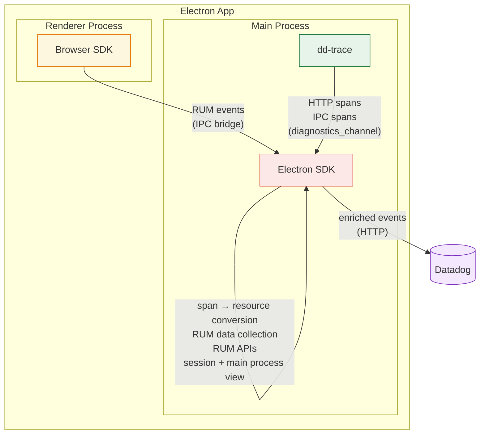
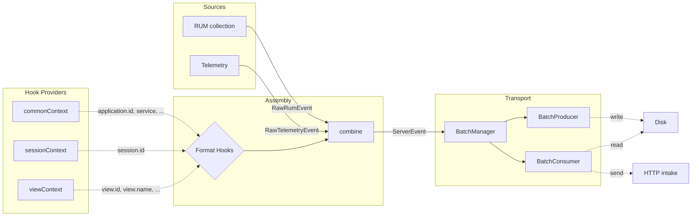

# Architecture

Describes general patterns with examples — detailed component documentation lives as JSDoc on the classes themselves (e.g., `SessionManager`, `ViewCollection`).

## Monitoring Architecture



### Main Process

The Electron SDK captures RUM sessions, collects RUM events, and forwards them to Datadog, enriching events from dd-trace and the Browser SDK with RUM and Electron context along the way. dd-trace instruments network requests, command executions, and IPC calls, then forwards spans to the Electron SDK through the `diagnostics_channel`.

More details in the [How tracing works](#how-tracing-works) section.

### Renderer Process

The SDK exposes a `DatadogEventBridge` to every renderer process via its own preload script. When present, the Browser SDK detects the bridge and routes events through IPC to the Electron SDK instead of sending them directly to Datadog servers. The bridge also answers the renderer's identity questions (`getSessionId`, `getAnonymousId`).
More details in the [Preload injection](#preload-injection) section.

## Event Pipeline



### Event Manager

The `EventManager` provides a handler-based pipeline for processing events.

#### Event Kinds

- **`RawEvent`** — Emitted by domain code, contains event-specific data, a source (`MAIN` | `RENDERER`), and a format (`RUM` | `TELEMETRY`).
- **`ServerEvent`** — Ready for transport, tagged with a track (`RUM` | `LOGS`).
- **`LifecycleEvent`** — Internal signals (e.g., `END_USER_ACTIVITY`, `SESSION_RENEW`), not sent to intake.

#### Handler Pattern

Handlers register on `EventManager` with `canHandle` (type guard) and `handle` (processing + optional `notify` callback to emit derived events).

See `src/event/` and `src/domain/assembly.ts`.

### Assembly and Format Hooks

The `Assembly` handler transforms `RawEvent` into `ServerEvent` by enriching raw data with contextual properties via format hooks.

#### Format Hooks

`createFormatHooks()` creates per-format hook pairs (`registerRum`/`triggerRum`, `registerTelemetry`/`triggerTelemetry`). Each hook callback can return:

- **Partial data** — merged into the event via `combine()`
- **`DISCARDED`** — drops the event entirely
- **`SKIPPED`** — this callback has nothing to contribute

Hooks are used by different parts of the SDK to attach their context (e.g., `registerCommonContext` adds `session`, `application`, `service`; `sessionManager` adds `session.id`).

See `src/domain/hooks/` and `src/domain/commonContext.ts`.

## SDK Telemetry

Internal observability for the SDK itself. Captures SDK errors and sends them as telemetry events.

- **Sampling**: controlled by `telemetrySampleRate` config, evaluated once per session.
- **Rate limiting**: capped per session, counter resets on `SESSION_RENEW`.
- **Error collection**: wrappers catch uncaught errors and errors in callbacks, emitting them as telemetry events.

See `src/domain/telemetry/`.

## APM Tracing (dd-trace integration)

The SDK integrates with dd-trace (bundled) for span collection, HTTP resource tracing, and automatic preload injection.

dd-trace links:

- [electron plugin (net, ipc)](https://github.com/DataDog/dd-trace-js/tree/master/packages/datadog-plugin-electron/src)
- [electron instrumentation (preload bridge)](https://github.com/DataDog/dd-trace-js/tree/master/packages/datadog-instrumentations/src/electron)
- [electron exporter](https://github.com/DataDog/dd-trace-js/blob/master/packages/dd-trace/src/exporters/electron/index.js)

### Instrumentation (`@datadog/electron-sdk/instrument`)

dd-trace instruments modules by hooking `require()`. For this to work, it must be initialized **before** `require('electron')`. The SDK provides a dedicated entry point for this:

```typescript
import '@datadog/electron-sdk/instrument'; // must be first
import { app, BrowserWindow } from 'electron';
```

This entry point initializes dd-trace with the `electron` exporter and silently no-ops if dd-trace is unavailable. Because it runs before `electron` is imported, dd-trace can:

- Hook `require('electron')` to wrap `BrowserWindow` for automatic preload injection
- Instrument Electron's `net` module, `ipcMain`, and Node.js `http` for span collection

### How tracing works

The SDK's own uploads are kept out of the data it collects at the **instrumentation** layer: `Tracing` passes dd-trace a `blocklist` matching the intake origin, and every path that produces an outbound HTTP span (`node:http`/`https`, global `fetch`, Electron `net.request`) derives from `HttpClientPlugin`, which applies it before recording. A blocked request produces no span at all, so it cannot become a resource event and generate the next upload. The origin comparison includes the **port**, which is what makes it correct when the intake shares a host with the application's own services.

dd-trace's `electron` exporter publishes normalized spans to a Node.js diagnostics channel (`datadog:apm:electron:export`) instead of sending them to a local Datadog Agent. The `SpanProcessor` subscribes to this channel and:

1. **Filters** SDK-internal requests, as a second line of defense behind the blocklist above
2. **Enriches** all spans with electron context (application, session, view)
3. **Emits** RUM resource events for HTTP spans
4. **Forwards** all spans to the spans intake grouped per trace

```
Instrumented code (fetch, net.request, ipcMain.handle, http)
    ↓
dd-trace creates spans
    ↓
ElectronExporter → diagnostics channel 'datadog:apm:electron:export'
    ↓
SpanProcessor (filters, enriches, emits)
    ↓
All spans → Transport → /api/v2/spans
HTTP spans → Assembly → Transport → /api/v2/rum (as RUM resources)
```

All spans are enriched with electron context (`_dd.application.id`, `_dd.session.id`, `_dd.view.id`) via the span assembly hook. Trace and span IDs are converted to **hexadecimal strings** for the spans intake.

The instrument entry point sets `flushMinSpans: 1`, so a span reaches the exporter as soon as it finishes. dd-trace otherwise only exports a trace once every span in it has finished (its default partial-flush threshold, 1000 finished spans, is out of reach for a desktop app), which let one request that never returns withhold the resource events of every sibling request in the same IPC handler. Attribution is unaffected: a resource event is placed by its own span's start time, not the trace's.

### Preload injection

The bridge preload is the SDK's own script (`dist/preload.js`, exported as `@flashcatcloud/electron-sdk/preload`). It is a standalone CJS file whose only dependency is `electron`, because preload scripts run in a sandbox where nothing else is guaranteed to be requireable.

`installBridgePreload()` — called by the instrument entry — registers it on `app.on('session-created')` plus the default session at app ready. Hooking session creation rather than wrapping `BrowserWindow` covers custom partitions and works whether the app reaches `BrowserWindow` through `require` or a static ESM `import`.

dd-trace ships a bridge preload of its own and registers it from the `BrowserWindow` subclass it installs when it hooks `require('electron')`. The SDK **redirects** that registration to its own script: only one bridge may reach the page (`contextBridge.exposeInMainWorld` throws on a duplicate key, and without context isolation the last writer of `window.DatadogEventBridge` wins), so letting both run would make the outcome depend on registration order. The script also guards itself with `window.__dd_bridge_initialized`, so a duplicate registration is a no-op.

dd-trace still needs to hook `require('electron')` **before** electron is loaded, for `net` and IPC instrumentation. This is straightforward in non-bundled environments but requires bundler plugins for Vite and Webpack:

- **Vite** hoists all `require()` calls to the top of the bundle, breaking import order. The `datadogVitePlugin` (`@flashcatcloud/electron-sdk/vite-plugin`) fixes this by externalizing dd-trace, prepending initialization before hoisted requires, and copying dd-trace's runtime dependencies into the build output for packaged apps.
- **Webpack** preserves module execution order (lazy evaluation via `__webpack_require__`), so the import order in source code is maintained. The `DatadogWebpackPlugin` (`@flashcatcloud/electron-sdk/webpack-plugin`) copies the SDK and dd-trace into the webpack output's `node_modules` so both — and the preload shipped inside the SDK package — are available in packaged apps.
- **esbuild** preserves module execution order (like Webpack), so `import '@flashcatcloud/electron-sdk/instrument'` runs before `import 'electron'` without special hoisting tricks. The `datadogEsbuildPlugin` (`@flashcatcloud/electron-sdk/esbuild-plugin`) externalizes dd-trace and prepends an initialization banner. Unlike the Vite and Webpack plugins, it does **not** copy dependencies into the build output (esbuild lacks an equivalent post-emit hook) — the packaging tool (e.g., Electron Forge, electron-builder) must ensure `node_modules` is available at runtime.

### User identity

The device-scoped anonymous id (`src/domain/AnonymousId.ts`) is generated once and stored in `app.getPath('userData')`, so it survives restarts. Unique-user counts are derived from it: a session id is renewed as the user comes and goes, so only an id that outlives the session can count an install.

`registerCommonContext` stamps it on every main-process RUM event as `usr.anonymous_id`. The synthetic `electron://main-process` view is usually a session's first, and the session takes its user identity from that first view — without the field, a main-process-only session would have none.

**`usr.id` is never backfilled with it.** Electron is counted off `COALESCE(NULLIF(usr_anonymous_id, ''), NULLIF(usr_id, ''))`, which reads the anonymous id first and is stable across a login. The browser SDK does backfill, because its count is `COUNT(DISTINCT usr_id)` and that is the only way it can see logged-out users; copying that here would buy nothing and would split one device into two people at login, when `usr.id` flips from the anonymous id to the real one. `src/assembly/commonContext.spec.ts` pins this down.

Renderer events keep the `anonymous_id` they arrive with: the renderer reads the same id off the bridge itself, so the main process must not stamp a second one over it.

#### The logged-in identity (`setUser`)

`setUser` / `getUser` / `clearUser` (`src/domain/UserContext.ts`) record who the application says is logged in, next to — never instead of — the anonymous id. The names match `flashcatRum.setUser()` in `@flashcatcloud/browser-rum` so both processes of one application share a vocabulary; upstream's `@datadog/electron-sdk` calls it `setUserInfo`, a name Datadog's own browser SDK has since dropped, and we do not track that fork.

Only `id`, `name` and `email` are copied out of the caller's object, and `id` is required. Dropping everything else is what makes `setUser({ anonymous_id })` structurally impossible; the hook also writes `anonymous_id` last, so the guarantee does not rest on the sanitizer alone. Upstream's `ContextManager.filterReservedKeys` excludes only the standard fields from its free-form `extraInfo` bag, so `addUserExtraInfo({ anonymous_id })` there overwrites the device id — **if `extraInfo` is ever added here, `anonymous_id` has to be reserved with it.**

An invalid call is rejected whole rather than half-applied, and does not notify renderers: a partly-applied identity is harder to notice than none.

**Two questions, two stores.** `get()` answers "who is logged in now" from a plain field, so `clearUser()` takes effect in the millisecond it happens. Event assembly instead asks `find(startTime)`, backed by a `DiskValueHistory` like `ViewContext`'s, because a main-process event is not always assembled in the moment it describes — a native crash is parsed on the _next_ startup carrying the crash's own timestamp, and `addError` accepts a caller-supplied `startTime`. Resolving those at assembly time would hand one user's crash to another. `set()` closes the previous entry and opens the next from a **single** clock read, the millisecond race `ViewCollection.createNewView` avoids the same way.

Persistence has a consequence worth knowing: the identity is written to `userData` in plain text, beside the anonymous id and the session file.

**View events are the exception: they resolve at the moment they are emitted.** A view is an interval, re-reported as it grows (`_dd.document_version`), and the backend derives the session's identity from the _last_ view row it receives (`buildSessionViewUpdates` in fc-rum reads `lastView.UserID`). The main process emits exactly one synthetic view per session, spanning the whole session, and `setUser` cannot run before `init` — so resolving that view at its start time would keep the identity off `t_sessions.usr_id` for the entire session. Verified against dev: without this the session row carried an empty `usr_id` while the error events beside it carried the full identity.

**A restored history is closed at startup, one millisecond before now.** Quitting is not logging out, so a previous run normally leaves its entry open; restoring it still-active attributed this process's events to whoever used the machine last. Closing it at exactly `now` is not enough, because `find` treats `endTime` as inclusive and the first main-process view is created in the same millisecond as `init` — observed against dev, where a second run stamped its opening view with the first run's user. Earlier timestamps still resolve to that user, which is what a crash from the previous run needs.

**`clearUser` removes `usr.id`; it never blanks it.** `NULLIF(usr_id, '')` treats an empty string and an absent field as different rows.

### Renderer identifiers

The renderer needs the main process's session id to attribute anything it uploads itself, and the same device id so both halves of a session count as one user. Both are answered synchronously by the bridge:

- `getAnonymousId()` — the id above. It never changes once the SDK is initialized.
- `getSessionId()` — the session the main process considers active, or `''` while none is. Sessions expire and renew, so the main process **pushes** a fresh configuration over `datadog:bridge-config-push` on every change; the preload caches it and answers from the cache. A synchronous IPC call per event would be far too slow.

- `getUser()` — the identity set through `setUser`, as JSON, or `'{}'` when nobody is logged in. A string rather than an object, matching `getCapabilities` and `getAllowedWebViewHosts`; it rides the same configuration push and the same preload cache as the session id.

**The bridge getter is not how bridged renderer events get their identity.** The Browser SDK's bridge contract has no user getter, so nothing would read it today; `Assembly.assembleRendererRumEvent` stamps the identity on renderer events as they pass through the main process instead, which needs no Browser SDK change. The getter is there so a renderer can attribute what it uploads _itself_ — Session Replay segments — to the same person, and is what a future Browser SDK would consume.

**The main process wins, and it replaces rather than merges.** `combine` merges per key and skips `undefined`, so merging a main-process `{ id, name }` over a renderer's `{ id, name, email }` would emit one person's id and name beside another's email — an identity belonging to nobody, and worse than either source alone. The deciding reason for main-process precedence is `clearUser()`: if a stale renderer-side identity could survive it, logging out would leave the user's name and email on everything that window kept reporting, so a logout has to be enforceable from one place. `usr.anonymous_id` is carried across the replacement untouched, and when no user is set nothing is touched at all — an application that only calls `flashcatRum.setUser()` in its renderers keeps the behaviour it had.

#### The renderer must never be able to outrun `init()`

The preload asks for its configuration over a **synchronous** channel, and Electron leaves a synchronous request that no `ipcMain` listener answers blocked forever — registering one afterwards does not release it. A renderer that starts before `BridgeHandler` exists would therefore hang before running a line of the page: a monitoring SDK bricking the application it monitors. `init()` is `async` and can be skipped entirely (it returns `false` on a configuration it rejects), so "the application initializes first" cannot be the thing that prevents this.

Two pieces close it, and the order between them is what makes it work:

- `installBridgePreload` registers a **fallback listener** on `datadog:bridge-config` before it registers any preload, answering with an unconfigured placeholder — no session, no device id, `mask` privacy. Nothing can ask before something can answer. `BridgeHandler` then _supersedes_ it (`removeAllListeners` first), because Electron answers a synchronous request with the **first** `returnValue` set, not the last.
- `BridgeHandler` **pushes once on construction**, catching up renderers that hold the placeholder. That push cannot land too early to be heard: a renderer holds the placeholder only if it asked before the constructor ran, and the preload subscribes to the push channel _before_ it asks.

`init-order.scenario.ts` pins both down — a window opened before the SDK is ready, and an application that never initializes at all.

**`''` is load-bearing, and is not the same as not implementing the getter.** The Browser SDK reads an empty answer as "the host has no session right now" and stops attributing data until the host answers with an id again; it only falls back to its own placeholder session id for a host too old to implement `getSessionId()` at all. That distinction is what keeps Session Replay off a fake session: the renderer uploads its segments itself instead of handing them to the main process, so nothing here can discard them after the fact, and a placeholder id is a constant every application built on this SDK would share. It also means the main process must never answer with the id an expired session used to have — that would attach segments to a session that has ended. `getActiveSessionId` in `src/index.ts` answers `''` for anything but an active session, and `bridge-window.scenario.ts` pins both the expiry and the renewal down.

See `src/preload/`, `src/bridge/BridgeHandler.ts`, `src/domain/AnonymousId.ts`, `src/assembly/commonContext.ts`, `src/domain/tracing/`, `src/entries/instrument.ts`, `src/entries/vite-plugin.ts`, `src/entries/webpack-plugin.ts`, and `src/entries/esbuild-plugin.ts`.

### dd-trace as a bundled dependency

dd-trace is declared as a **direct runtime dependency** in `package.json`, not as an optional or peer dependency. When customers install `@datadog/electron-sdk`, they get dd-trace automatically.

#### Why bundle it

dd-trace's module hooking must initialize before `require('electron')`. This creates tight coupling between the SDK and dd-trace:

- The SDK's `instrument` entry point calls `tracer.init({ exporter: 'electron' })` — a custom exporter built specifically for the Electron SDK
- The `SpanProcessor` subscribes to a specific diagnostics channel (`datadog:apm:electron:export`) that dd-trace publishes to
- Bundler plugins know dd-trace's internal layout (e.g., the preload script path `dd-trace/packages/datadog-instrumentations/src/electron/preload.js`)

Making it a direct dependency ensures a single, tested version is always present. The alternatives were considered:

| Approach                                             | Pros                                                                                | Cons                                                                                                                                                                      |
| ---------------------------------------------------- | ----------------------------------------------------------------------------------- | ------------------------------------------------------------------------------------------------------------------------------------------------------------------------- |
| **Direct dependency** (current)                      | Guaranteed compatible version; no setup burden on customers; deterministic behavior | Larger install footprint; version locked to SDK releases                                                                                                                  |
| **Peer dependency**                                  | Customer controls version; smaller SDK package                                      | Version mismatch risk; customer must install separately; hard to guarantee the custom `electron` exporter exists in their version                                         |
| **Optional dependency**                              | —                                                                                   | SDK does not work without dd-trace; same mismatch risk as peer; confusing DX                                                                                              |
| **Vendored / embedded in SDK bundle** (POC approach) | Single file, no transitive deps                                                     | Fragile — dd-trace uses dynamic requires, native module loading, and runtime path resolution that break when bundled into a single file; would need constant re-vendoring |

#### Optional dependencies are stripped

dd-trace declares optional dependencies (OpenTelemetry bindings, OpenFeature, ASM, IAST, etc.) that are irrelevant for Electron:
These optional dependencies may or may not install in the customer's `node_modules` depending on platform and package manager behavior. Critically, the **bundler plugins only copy `dependencies`, not `optionalDependencies`**, when populating the build output's `node_modules`. This means they are always excluded from the packaged app.

#### Dependency size

| What                                                                     | Size      | Notes                                             |
| ------------------------------------------------------------------------ | --------- | ------------------------------------------------- |
| dd-trace (stripped, no optional deps)                                    | ~7 MB     | The core dd-trace package                         |
| Runtime transitive deps (dc-polyfill, import-in-the-middle, acorn, etc.) | ~1 MB     | Required by dd-trace at runtime                   |
| **Total copied to packaged app**                                         | **~8 MB** | What bundler plugins copy via `copyPackageTree`   |
| electron-sdk own dist                                                    | ~4 MB     | SDK code + WASM chunks                            |
| dd-trace optional deps (NOT copied)                                      | Unknown   | Native modules, etc — excluded from packaged apps |

The `copyPackageTree` function in the Vite and Webpack plugins walks only the `dependencies` field of each package's `package.json`, so the ~84 MB of optional native modules never end up in the packaged app.

## Two-Tier Configuration

`InitConfiguration` (user API) → `buildConfiguration()` → `Configuration` (internal, validated).

- **Required fields** (e.g. `clientToken`): validation returns `undefined` to signal initialization should abort — no exceptions thrown.
- **Optional fields** (e.g. `env`): invalid values silently fall back to `undefined`.

See `src/config.ts`.
